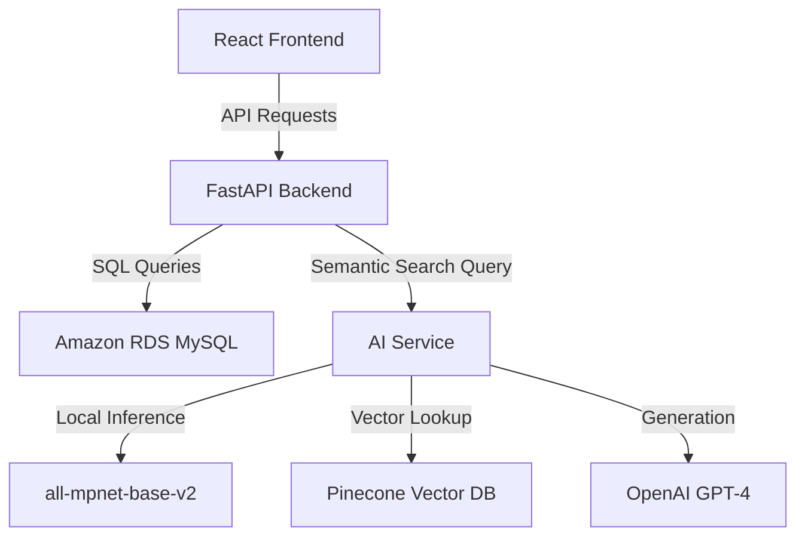

# 🚀 AI-Powered Ecommerce Platform

A production-ready ecommerce architecture featuring **Semantic Search**, **Automated AI Embeddings**, and a high-performance **Product Management System**.

---

## 🏗️ System Architecture

This project follows a microservices-inspired architecture designed for scale and superior search experience.



### 1. **React Frontend** (`/frontend`)
- **Key Features**: High-density product grid (Amazon-style), AI-integrated search bar, responsive layout.
- **Tech Stack**: React 18, Vite, Lucide Icons, Vanilla CSS (Utility layer).
- **Optimization**: Instant result clearing and smooth transitions for sub-100ms perceived latency.

### 2. **Core Backend** (`/backend`)
- **Key Features**: RDS MySQL integration, CRUD for millions of products, data seeding scripts.
- **AI Orchestration**: Proxies semantic search requests to the AI Service and handles result merging.
- **Tech Stack**: FastAPI, SQLAlchemy, Pandas, Pymysql.

### 3. **AI Service** (`/ai_service`)
- **Key Features**: 
    - **Semantic Search**: Uses `all-mpnet-base-v2` locally for high-speed vector embeddings.
    - **Pinecone Integration**: Low-latency vector retrieval for semantic similarity.
    - **LLM Integration**: OpenAI GPT integration for smart product analysis.
- **Tech Stack**: FastAPI, Sentence-Transformers, Pinecone SDK, OpenAI SDK.

---

## 🛠️ Setup & Installation

### 📋 Prerequisites
- **Python 3.9+**
- **Node.js 18+**
- **MySQL Instance** (Local or Amazon RDS)
- **Pinecone API Key** & **OpenAI API Key**

### 1️⃣ AI Service Setup
```bash
cd ai_service
python -m venv venv
source venv/bin/activate  # On Windows: venv\Scripts\activate
pip install -r requirements.txt

# Configure Environment
cp .env.example .env
# Edit .env with your Pinecone and OpenAI keys

# Start Service (Runs on http://localhost:8006)
python main.py
```

### 2️⃣ Backend API Setup
```bash
cd backend
python -m venv venv
source venv/bin/activate
pip install -r requirements.txt

# Configure Environment
cp .env.example .env
# Edit .env with your RDS/MySQL credentials

# Start API (Runs on http://localhost:8005)
python api.py
```

### 3️⃣ Frontend Setup
```bash
cd frontend
npm install

# Configure Environment
cp .env.example .env
# Ensure VITE_API_BASE_URL points to your backend (default: http://localhost:8005)

# Start Dev Server (Runs on http://localhost:5173)
npm run dev
```

---

## 📦 Database Schema
The system is optimized for the **Amazon Products Dataset** (~1.4M products).

| Column | Type | Description |
| :--- | :--- | :--- |
| `asin` | VARCHAR | Primary Key |
| `title` | TEXT | Product Title |
| `price` | FLOAT | Listed Price |
| `imgUrl` | TEXT | Thumbnail Image URL |
| `stars` | FLOAT | Average Rating |
| `reviews` | INT | Review Count |
| `isBestSeller` | BOOLEAN | Amazon Best Seller flag |

---

## 📄 License
This project is part of the **Alumnx Ecommerce Engineering Program**. Distributed under the MIT License.